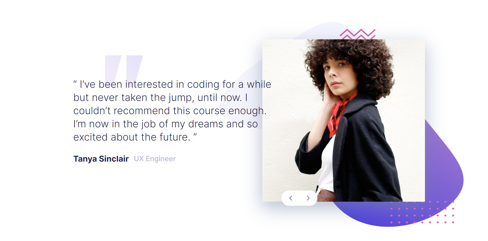

# Frontend Mentor - Coding bootcamp testimonials slider solution

This is a solution to the [Coding bootcamp testimonials slider challenge on Frontend Mentor](https://www.frontendmentor.io/challenges/coding-bootcamp-testimonials-slider-4FNyLA8JL). Frontend Mentor challenges help you improve your coding skills by building realistic projects. 

## Table of contents

- [Overview](#overview)
  - [The challenge](#the-challenge)
  - [Screenshot](#screenshot)
  - [Links](#links)
- [My process](#my-process)
  - [Built with](#built-with)
  - [What I learned](#what-i-learned)
- [Author](#author)

## Overview

### The challenge

Users should be able to:

- View the optimal layout for the component depending on their device's screen size
- Navigate the slider using either their mouse/trackpad or keyboard

### Screenshot




### Links

- Solution URL: [https://www.frontendmentor.io/solutions/coding-bootcamp-testimonials-slider-using-flexbox-TlhYYpx_1y](https://your-solution-url.com)
- Live Site URL: [https://awsmpuff.github.io/coding-bootcamp-testimonials-slider/](https://your-live-site-url.com)

## My process

### Built with

- Semantic HTML5 markup
- CSS custom properties
- Flexbox

### What I learned

Use this section to recap over some of your major learnings while working through this project. Writing these out and providing code samples of areas you want to highlight is a great way to reinforce your own knowledge.

To see how you can add code snippets, see below:

```js
// Learn about previousElementSibling & nextElementSibling
```


## Author

- Website - [Wanxia Xie/Laurenxx](https://www.your-site.com)
- Frontend Mentor - [@awsmPuff](https://www.frontendmentor.io/profile/awsmPuff)
